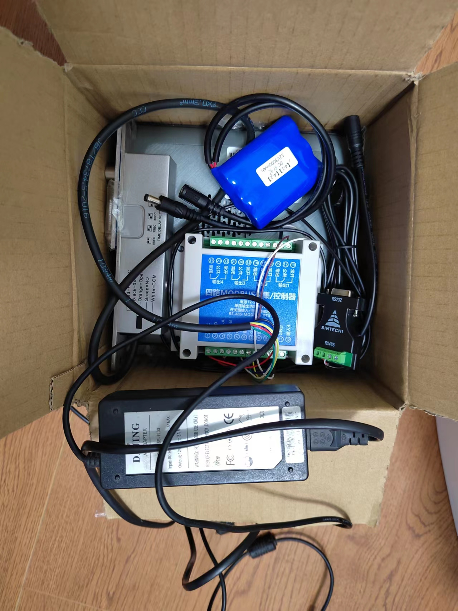
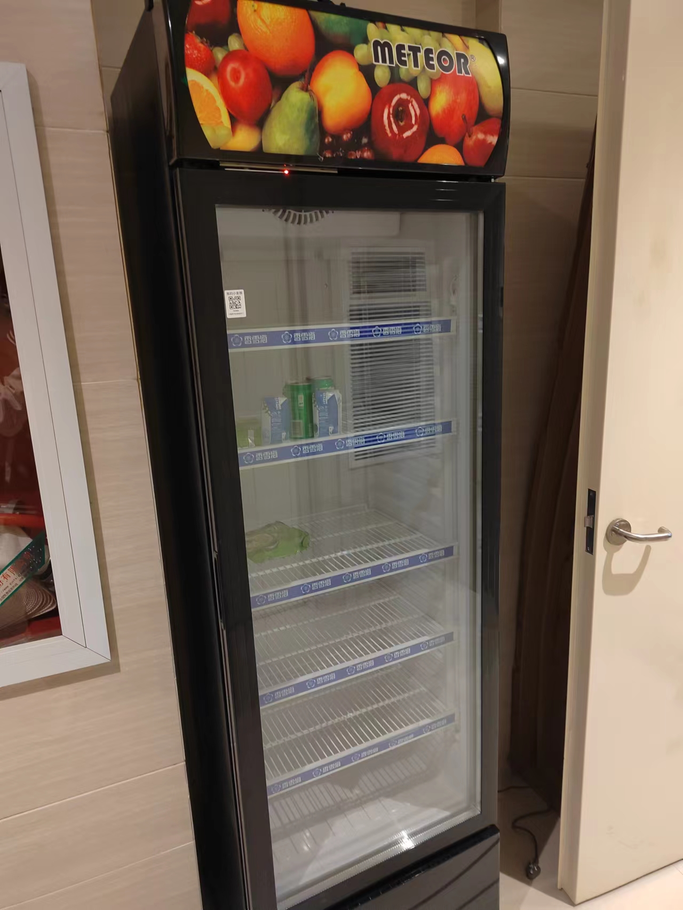

### 项目介绍

我的小卖部是一款扫码开门智能AI无人售货柜软硬件一体的解决方案，用户使用微信或者支付宝扫码开门，拿了就走，系统自动识别拿取的商品计算价格，自动扣款，方便便捷，并且成本可控。

### 项目背景

我本人完全是出于兴趣，好玩，无聊才兼职搞这个项目的。在上家公司shein（国内跨境电商独角兽）工作的时候办公室里有一台丰E足食的无人售货柜，当时比较好奇，感觉很好玩，就想着自己业余搞搞，顺便还能挣点零花钱。然后就开始了苦逼的兼职开发之路。

### 开发历程
项目从想法到能用经历了大概一年的时间，当时我们家小孩还没出生，现在已经正好1岁了。为什么经历了这么长时间，主要是因为没有时间，有了小孩事情多。不过幸好坚持下来了，现在可以正常使用，而且拉了一些正在大厂工作的一些大学同学和朋友一起完善它。

### 合作方式
我们目前打算走的是半开源+SAAS的技术服务输出模式。即开源C端用户的小程序（支付宝/微信，uniapp开发）让用户集成或者创建自己的品牌，后端服务依然使用我们提供的SaaS服务。
说一下这种方式的好处：

1. 用户可以建立自己的品牌，并集成到自己已有的软件中去

2. 我们这边更好维护，上新功能/bug修复（相较全开源或者独立部署）

3. 毕竟兼职熬了不少夜做的项目，想有点经济上的收入（具体价格看下文），这样也可以持续维护这个项目。

4. 当然，我们也支持独立部署，财大气粗的客户也可以源码输出或者把我们的业务开发团队“包养”

  我们也有公司，大学的时候注册的，目前没有实际运营，可以用来签对公订单

### 合作价格

| 项目       | 范围         | 价格                                                         |
| ---------- | ------------ | ------------------------------------------------------------ |
| 设备数     | 累计0-10台   | 新购套件单门1千，双门1400，1台起 自采硬件450元/台，15台起 所有设备30元/台/月 |
|            | 累计11-30台  | 新购套件单门950，双门1300，20台起 自采硬件400元/台，20台起 所有设备29元/台/月  |
|            | 累计31-60台  | 新购套件单门900，双门1200，30台起 自采硬件350元/台，30台起 所有设备28元/台/月  |
|            | 累计60-100台 | 新购套件单门880，双门1150，40台起 自采硬件300元/台，40台起 所有设备27元/台/月  |
|            | 累计100台+   | 新购套件单门800，双门1100，50台起 自采硬件260元/台，50台起 所有设备25元/台/月 |
| 月均订单数 | 0-2000单     | 0.2元/单                                                       |
|            | 2000-5000单  | 0.18元/单                                                     |
|            | 5000-1万单   | 0.15元/单                                                     |
|            | 1万单-2万单  | 0.13元/单                                                     |
|            | 2万单+       | 0.11元/单                                                     |

需要一体冰柜的我们也可以提供厂家，和我们的套件匹配的冰柜。售后和物流方面您和厂家自己协商。

### 套件及配置

| 设备名称                | 数量               | 规格                            | 备注                       |
| ----------------------- | ------------------ | ------------------------------- | -------------------------- |
| 主控                    | 1                  | 1037U 4G+64G                    | 二手，半年内有质量问题免费换 |
| 门锁                    | 单门一个，双门两个 | 电插锁，7芯（带门磁和锁芯侦测） | 全新                       |
| rs485开关量采集输出模块 | 1                  | 4输入4输出                      | 全新                       |
| 1080p摄像头             | 单门一个，双门两个 | 1920*1080 30fps                 | 全新                       |
| 电源一个                | 1                  | 12V*3A                          | 二手，半年内有质量问题免费换 |
| 备用锂电池              | 1                  | 德力普 3000mAh                  | 全新                       |

### 普通冰柜组装的样机

稳定运行1个月，无重启

### 体验

#### C端用户

#### 运营管理小程序

首次登陆会提示没有绑定商户，请联系我们

### 关于我们

| 网名           | 经历 | 贡献                                     |
| -------------- | -------- | ---------------------------------------- |
| 会飞的猪       | 曾在恒生电子，阿里巴巴，shein工作过，目前在一家上市的跨境电商工作。主要从事后端架构设计，大数据人工智能（es、nlp）等工作 | 项目发起，核心流程开发实现 负责人 |
| 没头脑和不高兴 | 工曾在三星电子、字节跳动、微软等一系列互联网大厂工作，精通各种算法 | 终端开发                                 |
| 进击的小学生   | 资深开发工程师 | 后端开发                                 |
| 关谷的师哥     | 资深开发工程师 | 后端开发                                 |
| hdzc           | 资深开发工程师 | 后端开发                                 |
| ymfsder        | 资深开发工程师 | UI开发                                   |
| 谢哈哈         | 资深开发工程师 | 终端开发                                 |
| Lucky          | 资深测试，认真负责，不放过每一个bug | 测试                                     |

### 联系
称呼：会飞的猪

手机：17602547540

微信：xulang1016 （工作日时间请尽量使用微信，因为我在上班，不方便电话）

邮箱: 1053618636@qq.com