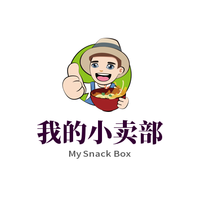

### 模块介绍

此模块是我的小卖部，无人AI售货柜的C端小程序源码，已经适配了微信支付宝，也可以适配成安卓/ios等。该模块完全开源，用户可以依据自己的需要，使用此代码自己建立自己的品牌小程序。

### 如何使用

如果您已经打算自建小程序，我们默认认为您是会小程序开发的。如果您不会可以联系我们团队，我们也提供相关服务（有偿）

修改 main.js中的 Vue.prototype.mid = "mysnackbox-demo"; 将 mysnackbox-demo 换成您自己的商户别名。

如何获取mid，您需要先联系我们进行分配

理论上就修改这一处小程序就可以正常运行了，当然您也可以进行源码修改，logo替换等，如果感觉我们开源的小程序不好看也可以整个重写，也可以和您已有的小厂进行集成。

### 小程序发布

小程序发布前，请先将 https://mysnackbox.mydataharbor.com:10086  添加为微信小程序的 request合法域名

小程序具体发布过程参考 https://www.jianshu.com/p/d2a43434a8e0，或者自行搜索

### 程序截图

|  |  |  |
| ------------------------------------------------------------ | ------------------------------------------------------------ | ------------------------------------------------------------ |
|  |  |  |

### 整体项目介绍及合作方式

[传送门](PROJECT.md)